# SKYRTOS — STM32F446 Roket Uçuş Bilgisayarı

> FreeRTOS tabanlı, çok sensörlü model roket uçuş bilgisayarı yazılımı.
> BMI088 IMU + BME280 barometre + L86 GNSS füzyonu, 7 fazlı uçuş durum makinesi,
> donanımda doğrulanmış (HIL) test altyapısı ve post-mortem gözlemlenebilirlik.

<p align="left">
  
  
  
  
  
  
</p>

---

## İçindekiler

- [Proje Özeti](#proje-özeti)
- [Öne Çıkan Özellikler](#öne-çıkan-özellikler)
- [Donanım Mimarisi](#donanım-mimarisi)
- [Yazılım Mimarisi](#yazılım-mimarisi)
- [Eş Zamanlılık Modeli](#eş-zamanlılık-modeli)
- [Sensör Pipeline'ları](#sensör-pipelineları)
- [İrtifa Kalman Filtresi](#i̇rtifa-kalman-filtresi)
- [Uçuş Durum Makinesi](#uçuş-durum-makinesi)
- [Güvenilirlik ve Hata Yönetimi](#güvenilirlik-ve-hata-yönetimi)
- [Gözlemlenebilirlik — Post-Mortem](#gözlemlenebilirlik--post-mortem)
- [Test Altyapısı (SIT / SUT)](#test-altyapısı-sit--sut)
- [Yer İstasyonu](#yer-i̇stasyonu)
- [Derleme](#derleme)
- [Proje Yapısı](#proje-yapısı)
- [Tasarım Felsefesi](#tasarım-felsefesi)

---

## Proje Özeti

SKYRTOS, bir model roketin tüm uçuşunu (fırlatma → motor yanması → tepe noktası →
paraşüt açılımı → iniş) bağımsız olarak yöneten bir **uçuş bilgisayarı**dır.
STM32F446RE (Cortex-M4 @ 180 MHz) üzerinde **FreeRTOS** ile çalışır.

Proje bilinçli bir mühendislik kararıyla şekillendi: kendi RTOS çekirdeğini
yazmak yerine olgun bir RTOS'a yaslanmak. Stack overflow, hard fault, race
condition ve scheduler edge-case'leri **FreeRTOS**'a devredildi; tasarım enerjisi
mimari netliğe, sensör füzyonuna ve test edilebilirliğe ayrıldı. Hedef çekirdek
yazmak değil; **güvenilir, okunabilir ve jüriye anlatılabilir bir uçuş bilgisayarı
mimarisi** kurmak.

> Bu bir **bitirme projesi**dir. Kod tabanı; küçük, doğrulanabilir adımlarla
> ilerleyen, tek sahipli veri akışına dayanan, blocking çağrı içermeyen bir
> yaklaşımla yazılmıştır.

---

## Öne Çıkan Özellikler

| Alan | Özellik |
| ---- | ------- |
| **Sensör füzyonu** | BMI088 (6DOF) Mahony AHRS + BME280 baro + 3-state irtifa Kalman filtresi |
| **Konum** | L86 GNSS, USART6 circular DMA, NMEA parse, 1 Hz snapshot |
| **Uçuş mantığı** | 7 fazlı durum makinesi; IMU yokken **baro-only degraded mod** |
| **Eş zamanlılık** | ISR → task notification, task → task `xQueueOverwrite`/`xQueuePeek` (depth=1) |
| **Veri yolu** | Tüm I/O DMA üzerinden; ISR'da sadece `xTaskNotifyFromISR` |
| **Güvenilirlik** | IWDG watchdog (~2 s), stack overflow hook, fatal → `NVIC_SystemReset()` |
| **Gözlemlenebilirlik** | SEGGER SystemView **post-mortem** (canlı bağlantı gerektirmez) |
| **Test** | Donanımda SIT + SUT (HIL) test altyapısı + Python yer istasyonu |
| **Telemetri** | USART2 DMA binary frame, 50 Hz, 230400 baud |

---

## Donanım Mimarisi

STM32F446RE NUCLEO kartı üzerinde, her sensör kendi bus'ında ve veri-hazır
(DRDY) kesmesiyle yönetilir. ISR'lar yalnızca ilgili task'ı uyandırır; ağır iş
task bağlamında yapılır.

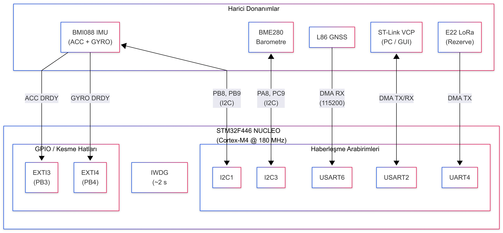

| Peripheral | Pin / Kanal | Görev |
| ---------- | ----------- | ----- |
| I2C1 | PB8 SCL, PB9 SDA | BMI088 (ACC + GYRO ortak bus) |
| I2C3 | PA8 SCL, PC9 SDA | BME280 barometre |
| EXTI3 / EXTI4 | PB3 / PB4 | BMI088 ACC / GYRO DRDY kesmeleri |
| USART6 | DMA RX | L86 GNSS |
| USART2 | DMA TX/RX | Telemetri + komut (ST-Link VCP) |
| UART4 | DMA TX | E22 LoRa (donanım hazır, rezerve) |
| IWDG | — | ~2 s donanım watchdog |
| BUZZER | PB14 | Durum sinyali |

---

## Yazılım Mimarisi

Kod, sorumlulukları net ayrılmış **4 katmana** bölünmüştür. Üst katmanlar yalnızca
alttakine bağımlıdır; sürücüler uygulama mantığını bilmez.

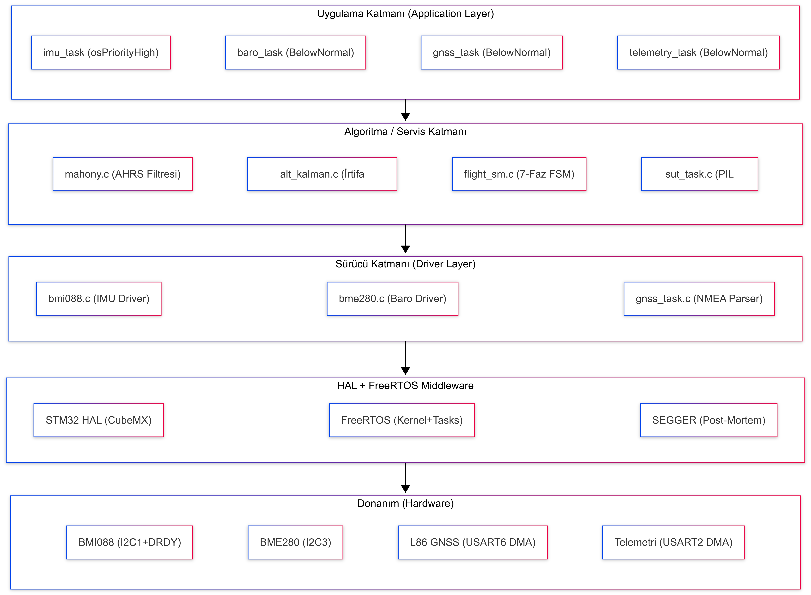

- **Uygulama katmanı** — FreeRTOS task'ları (`imu_task`, `baro_task`, `gnss_task`, `telemetry_task`)
- **Algoritma / servis katmanı** — `mahony.c` (AHRS), `alt_kalman.c` (irtifa füzyonu), `flight_sm.c` (durum makinesi), `sut_task.c` (HIL test)
- **Sürücü katmanı** — `bmi088.c`, `bme280.c`, GNSS NMEA parser
- **HAL + Middleware** — STM32 HAL (CubeMX), FreeRTOS çekirdeği, SEGGER SystemView

Tek giriş noktası vardır: `main()` → `osKernelStart()` → `MX_FREERTOS_Init()` →
`Application_Start()`. Tüm task'lar tek bir yerden, açık bir sırayla oluşturulur:

```c
void Application_Start(void)
{
    SEGGER_SYSVIEW_Conf();
    sys_mode_init();

    sut_task_create();      /* queue oluşturulur — cmd_task'tan önce */
    imu_task_create();
    baro_task_create();
    gnss_task_create();
    telemetry_task_create();
    cmd_task_create();
}
```

### Task modeli

| Task | Öncelik | Stack | Periyot | Görev |
| ---- | ------- | ----- | ------- | ----- |
| IMU | `osPriorityHigh` | 512 × 4 B | DRDY tetiklemeli | BMI088 oku + Mahony + snapshot |
| Baro | `osPriorityBelowNormal` | 512 × 4 B | 10 Hz | BME280 oku + Kalman + FSM tetikle |
| GNSS | `osPriorityBelowNormal` | 512 × 4 B | 1 Hz | NMEA parse + snapshot |
| Telemetry | `osPriorityBelowNormal` | 256 × 4 B | 50 Hz | UART2 DMA binary frame |

---

## Eş Zamanlılık Modeli

İki temel senkronizasyon kalıbı kullanılır ve proje boyunca tutarlıdır:

**1. ISR → Task: Task Notification.** Kesme bağlamında hiçbir iş yapılmaz; ISR
sadece `xTaskNotifyFromISR` ile task'ı uyandırır, DMA başlatma ve parse işlemleri
task bağlamında olur.

**2. Task → Task: depth=1 snapshot queue.** Veri üreten task `xQueueOverwrite`
ile yazar, tüketen task `xQueuePeek` ile okur. Queue derinliği 1 olduğundan her
zaman **en güncel** değer okunur, hiçbir taraf bloklanmaz ve veri kopyalanarak
aktarıldığı için pointer paylaşımı / race condition oluşmaz.

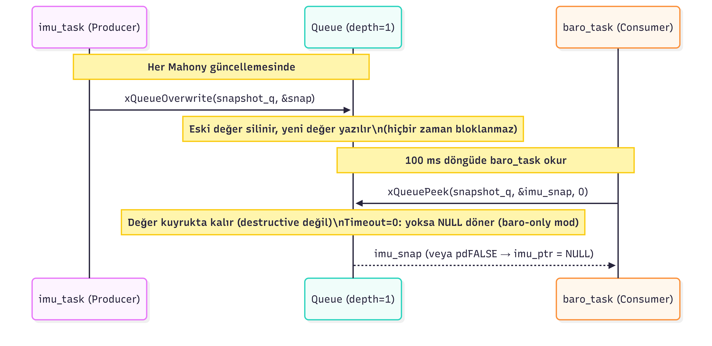

`xQueuePeek` timeout=0 ile çağrılır: snapshot henüz yoksa `false` döner ve
tüketen modül (ör. `baro_task`) **degraded modda** çalışmaya devam eder. Bu, bir
sensörün başlatılamaması durumunda sistemin çökmesini değil, düşük doğrulukla
çalışmasını sağlar.

> **Tasarım kararı:** Mutex ve semaphore kullanılmıyor. Veri sahipliği tek
> kaynaklıdır — her modülün iç state'ini yalnızca kendi task'ı yazar.

---

## Sensör Pipeline'ları

### IMU pipeline (BMI088 → Mahony AHRS)

BMI088'in ivmeölçer ve jiroskobu ayrı DRDY hatlarına (EXTI3 / EXTI4) sahiptir. Her
iki veri de geldiğinde Mahony 6DOF AHRS filtresi quaternion + Euler açılarını
günceller ve sonucu snapshot olarak yayınlar.

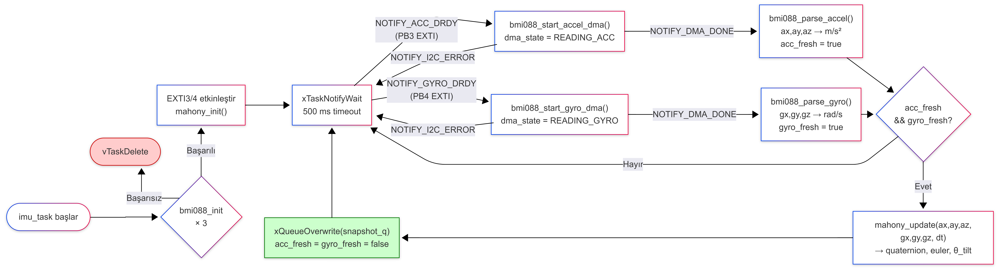

Akış: `DRDY EXTI` → `xTaskNotify` → `DMA başlat` → `parse (m/s², rad/s)` →
her iki örnek hazır olunca `mahony_update()` → `xQueueOverwrite(snapshot)`.

---

## İrtifa Kalman Filtresi

Barometre tek başına gürültülüdür ve gecikmelidir. `alt_kalman.c`, BME280 basınç
verisi ile (varsa) IMU dikey ivmesini birleştiren **3 durumlu** (irtifa, hız,
ivme bias) bir Kalman filtresi uygular. Filtre 10 Hz baro döngüsünde, IMU snapshot
ile beslenerek güncellenir.

Aşağıda aynı simülasyon verisinin ham hali (üst, CSV girdisi) ve STM32 üzerinde
Kalman filtresinden geçmiş hali (alt) görülüyor — gürültü belirgin biçimde
bastırılırken gecikme minimumda tutulmuştur:

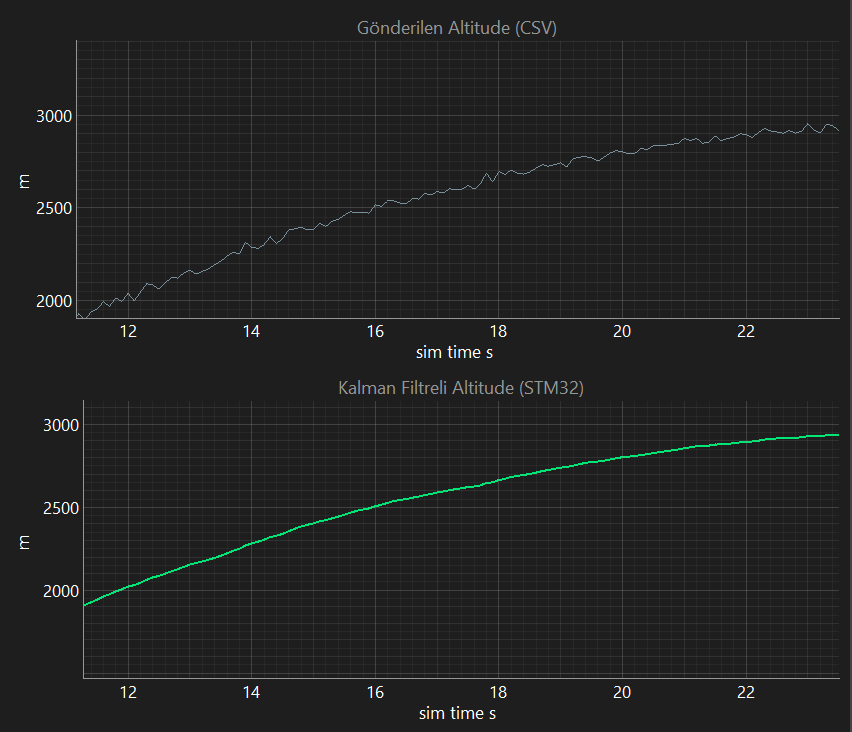

---

## Uçuş Durum Makinesi

`flight_sm.c`, uçuşu **7 faz** üzerinden yönetir. Her 10 Hz baro döngüsünde,
Kalman güncellemesinin hemen ardından çağrılır. Geçişler açık eşiklerle ve
kümülatif olay bayraklarıyla (`FSM_BIT_*`) yönetilir; bir kez set edilen olay
geri alınmaz.

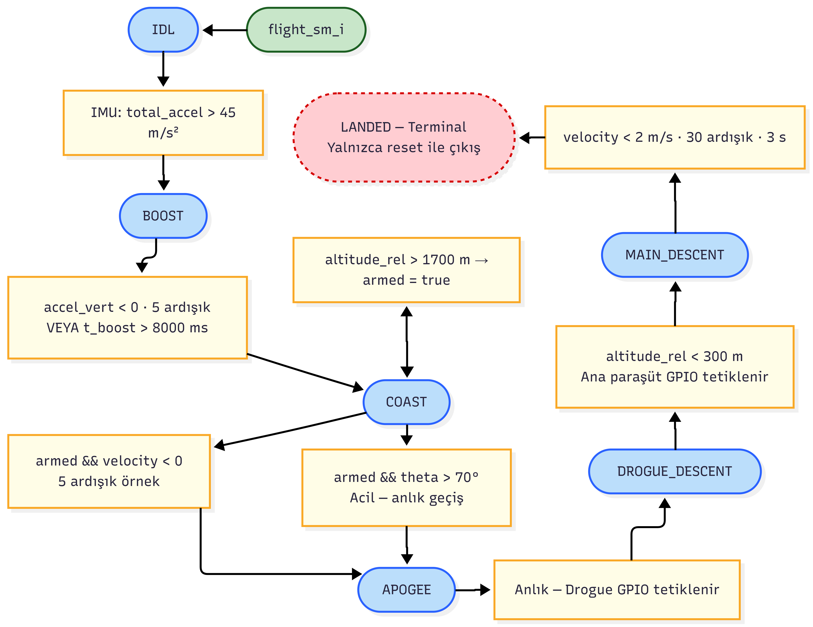

`IDLE → BOOST → COAST → APOGEE → DROGUE_DESCENT → MAIN_DESCENT → LANDED`

Tepe noktası tespiti çok katmanlıdır: hız işaret değişimi, tilt açısı eşiği
(acil drogue) ve minimum irtifa arming. Aşağıda tam bir simüle uçuşun barometrik
irtifası ve faz geçişleri görülüyor (apogee t = 25.7 s, h = 2960 m):

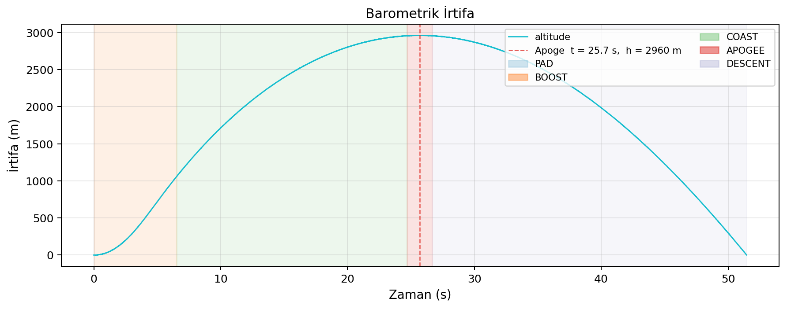

### Baro-only degraded mod

IMU başlatılamazsa sistem çökmez; düşük doğrulukla uçmaya devam eder. Bu
**kasıtlı bir güvenlik davranışı**dır:

| Özellik | IMU var | IMU yok |
| ------- | ------- | ------- |
| BOOST tespiti | IMU ivmesi > 45 m/s² | Baro hızı > 15 m/s |
| Kalman ivme girdisi | dikey ivme (IMU) | 0 (daha gürültülü) |
| Tilt-bazlı apogee | Aktif | Pasif (`imu==NULL` koruması) |
| Hız-bazlı apogee | Aktif | Aktif |
| BURNOUT / COAST / DROGUE / MAIN | Aktif | Aktif |

---

## Güvenilirlik ve Hata Yönetimi

Önceki projeden taşınan kritik hatalar bilinçli olarak elendi:

- **Donanım watchdog (IWDG)** — prescaler/256, reload 249 → ~2 s timeout;
  `baro_task` her 100 ms besler. Takılan bir task sistemi reset eder.
- **Stack overflow koruması** — `configCHECK_FOR_STACK_OVERFLOW 2` + hook;
  taşma anında `NVIC_SystemReset()`.
- **Fatal handler** — `Error_Handler()` artık sonsuz döngüye girmez,
  `NVIC_SystemReset()` çağırır.
- **Sessiz init hatası yok** — `bmi088_init` başarısız olursa IRQ açılmadan task
  silinir, `imu_snapshot_peek` hep `false` döner ve sistem baro-only moda geçer.
- **Boot sırası güvenli** — kesmeler ancak handle'lar set edildikten sonra açılır;
  init'te `HAL_Delay` değil `vTaskDelay` kullanılır.

---

## Gözlemlenebilirlik — Post-Mortem

JTAG ile canlı bağlantı kurmadan, **uçuştan sonra** ne olduğunu görebilmek için
SEGGER SystemView **post-mortem modunda** kullanılır: sistem çalışırken olaylar
RAM'deki bir ring buffer'a yazılır, sonra debugger ile dump edilip masaüstü
uygulamasında açılır.

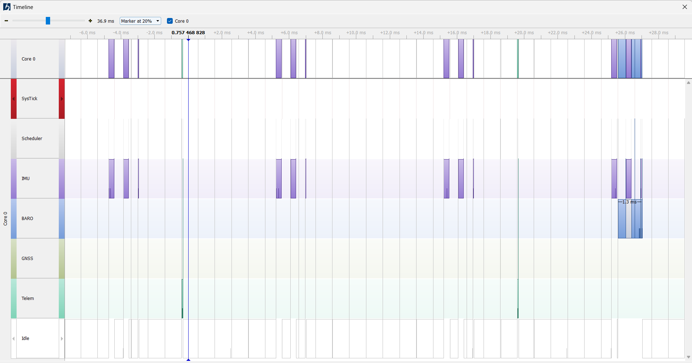

Yukarıdaki zaman çizelgesinde IMU (yüksek öncelik, DRDY tetiklemeli), Baro, GNSS
ve Telemetry task'larının gerçek zamanlama davranışı ve scheduler/SysTick olayları
görülüyor.

---

## Test Altyapısı (SIT / SUT)

Roketi gerçekten uçurmadan önce yazılım, donanım üzerinde (Hardware-in-the-Loop)
iki test modunda doğrulanır:

- **SIT (System Integration Test)** — Yer istasyonu STM32'ye komut gönderir, gerçek
  telemetri akışını canlı izler (sensör değerleri + 3B yönelim).
- **SUT (System Under Test)** — PC'den CSV senaryoları batch halinde STM32'ye
  gönderilir; STM32 üzerindeki **gerçek** Mahony + Kalman + FSM kodu çalıştırılır
  ve sonuç geri okunur. Böylece masaüstü simülasyon değil, **uçacak olan kodun ta
  kendisi** test edilir.

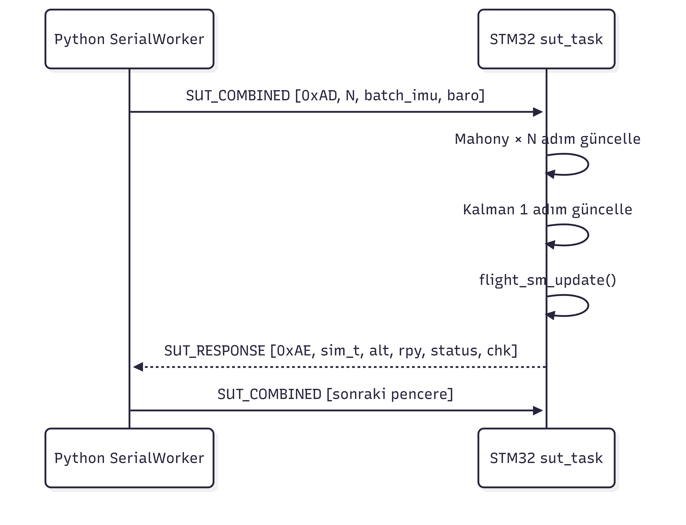

`SIT_SUT/` altında 7 farklı senaryo bulunur (az/çok irtifa gürültüsü, ivme
gürültüsü, irtifa zıplaması, nadir anomali) ve sonuçlar CSV olarak loglanır.

---

## Yer İstasyonu

`SIT_SUT/sut_tool/` altındaki Python (PyQt) yer istasyonu hem SIT hem SUT modunu
sürer: seri port yönetimi, canlı grafik, 3B roket yönelim görselleştirmesi ve
senaryo oynatma.

**SIT modu — canlı telemetri:** sensör değerleri tablosu, canlı irtifa grafiği ve
quaternion'dan sürülen 3B roket yönelimi.

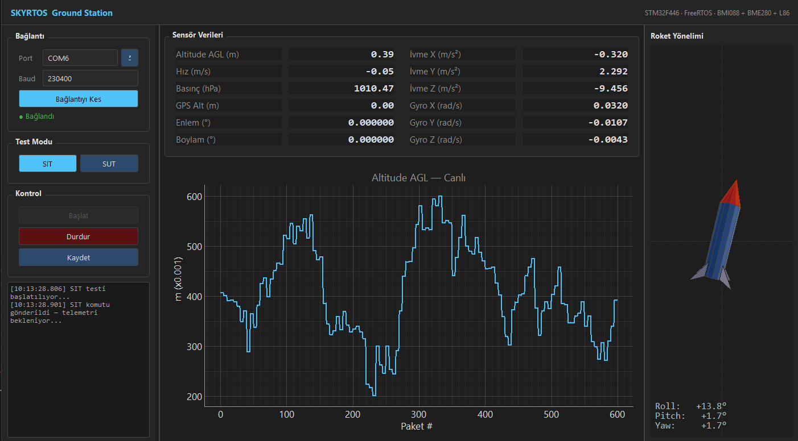

**SUT modu — senaryo oynatma:** gönderilen (CSV) ve STM32 Kalman çıktısı yan yana,
faz geçişleri işaretli; sağda 3B yönelim.

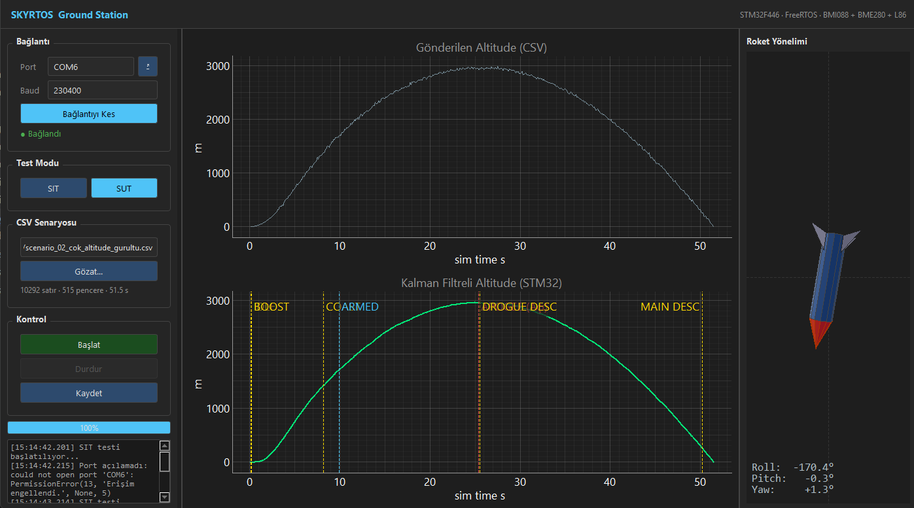

---

## Derleme

```powershell
# FreeRtos_project/ klasöründen
cmake --preset Debug
cmake --build build/Debug
```

Çıktı: `build/Debug/*.elf` + `.hex` + `.bin`

Araç zinciri: `arm-none-eabi-gcc` + CMake. Toolchain `cmake/` altında
tanımlıdır; CubeMX `.ioc` dosyası peripheral konfigürasyonunu üretir.

| Kaynak | Kullanım |
| ------ | -------- |
| Flash | ~75 KB / 512 KB (%14) |
| RAM | ~66 KB / 128 KB (%50) |

---

## Proje Yapısı

```
FreeRtos_project/
├── Core/
│   ├── Src/                 # Uygulama + sürücü + algoritma C dosyaları
│   │   ├── app.c            # Tek giriş noktası — task'ları oluşturur
│   │   ├── imu_task.c       # BMI088 pipeline
│   │   ├── bmi088.c         # BMI088 sürücüsü
│   │   ├── mahony.c         # Mahony 6DOF AHRS
│   │   ├── baro_task.c      # BME280 + Kalman + FSM tetikleme
│   │   ├── bme280.c         # BME280 sürücüsü
│   │   ├── alt_kalman.c     # 3-state irtifa Kalman filtresi
│   │   ├── gnss_task.c      # L86 GNSS + NMEA parse
│   │   ├── flight_sm.c      # 7 fazlı uçuş durum makinesi
│   │   ├── telemetry_task.c # USART2 DMA binary telemetri
│   │   ├── cmd_task.c       # Komut ayrıştırma (USART2 RX)
│   │   ├── sut_task.c       # HIL test (SUT) işleyici
│   │   └── iwdg.c           # Watchdog
│   └── Inc/                 # Başlıklar + snapshot struct'ları
├── Drivers/                 # STM32 HAL (CubeMX üretimi)
├── Middlewares/             # FreeRTOS + SEGGER SystemView
├── SIT_SUT/                 # Test senaryoları + Python yer istasyonu
├── docs/img/                # README görselleri
└── CMakeLists.txt
```

---

## Tasarım Felsefesi

> **Önce güvenilir ve anlaşılır çalışan basit sistem. Sonra genişletme.**

- **Spagetti yok.** Katmanlı mimari, tek sahipli veri akışı.
- **Kernel yazmak yok.** Olgun RTOS'a güvenilir; enerji mimariye ayrılır.
- **Blocking yok.** Tüm I/O DMA + notification üzerinden.
- **Adım adım.** Her adım doğrulanmadan bir sonrakine geçilmez.

---

<sub>STM32F446RE NUCLEO · FreeRTOS · BMI088 + BME280 + L86 · C11 / CMake</sub>
