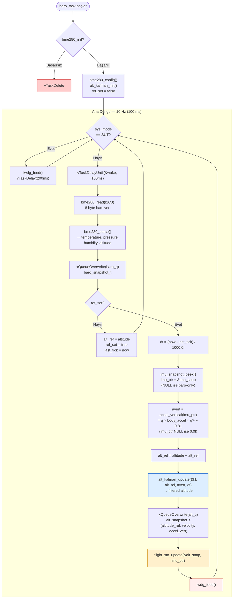

# Diyagram 5 — Baro Task Ana Döngüsü ve Kalman Entegrasyonu

Bölüm 3.4.2 ve 3.5.2 için. 10 Hz barometrik ölçüm → Kalman güncelleme → FSM tetikleme zinciri.

> **Referans kalibrasyonu:** Boot'taki ilk baro ölçümü `alt_ref` olarak alınır. Sonraki tüm ölçümler bu değere göre göreceli (`alt_rel`) hesaplanır. Bu, basınç değişimlerini irtifa değişimine doğru dönüştürür.
