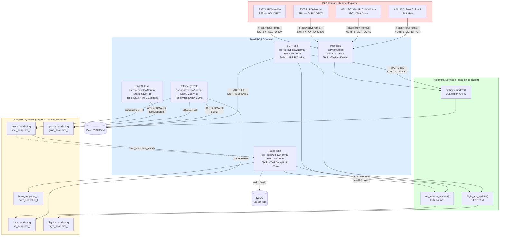

# Diyagram 3 — FreeRTOS Görev Mimarisi

Bölüm 3.3 için. Görev öncelikleri, tetikleme mekanizmaları ve aralarındaki iletişim kanalları.

> **SUT modu:** `sys_mode_get() == MODE_SUT` olduğunda IMU, Baro, GNSS ve Telemetri görevleri `vTaskDelay(200ms)` döngüsüne girer. Algoritmalar (Mahony, Kalman, FSM) yalnızca `sut_task` üzerinden çalışır.
