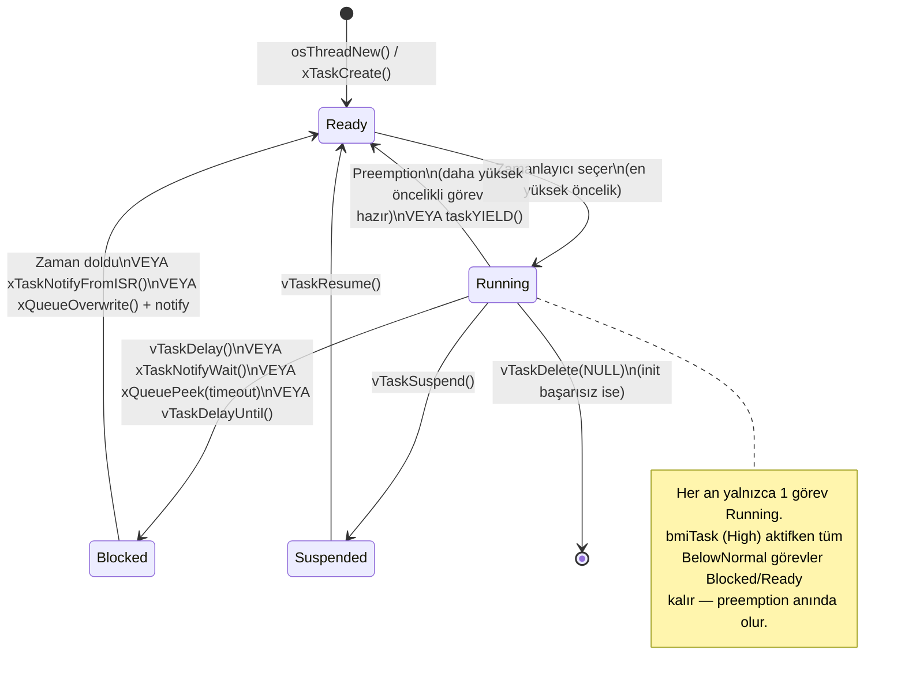
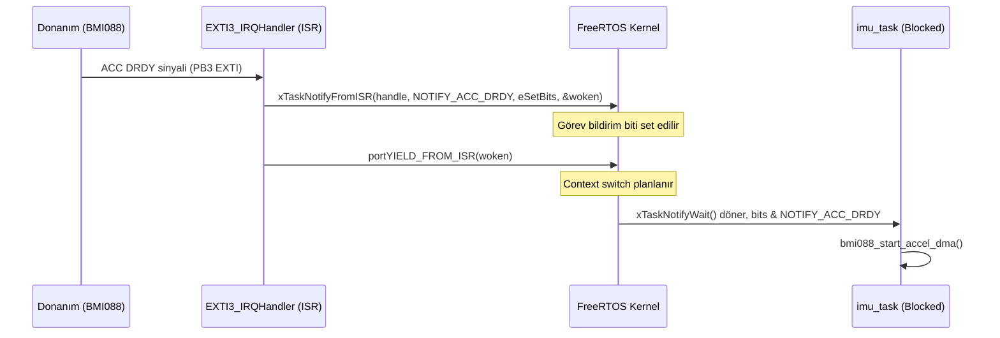
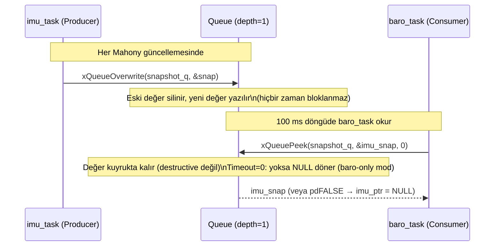
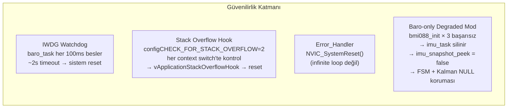

# Diyagram 10 — FreeRTOS Görev Durumları ve Snapshot Queue Mekanizması

Bölüm 2.5.1 ve 3.3 için. FreeRTOS durum geçişleri ile ISR→Task ve Task→Task iletişim kalıpları.

## FreeRTOS Görev Durum Makinesi

## ISR → Task Notification Kalıbı

## Task → Task Snapshot Queue Kalıbı (Mailbox)

## Güvenilirlik Mekanizmaları Özeti

> **Neden depth=1 queue yeterli:** Producer (imu_task) her zaman en güncel veriyi yazar; consumer (baro_task, telemetry_task) her okumada en güncel değeri alır. Eski değerlerin birikmesi anlamsız olduğundan `xQueueOverwrite` + `xQueuePeek` kombinasyonu lock-free mailbox işlevi görür.
