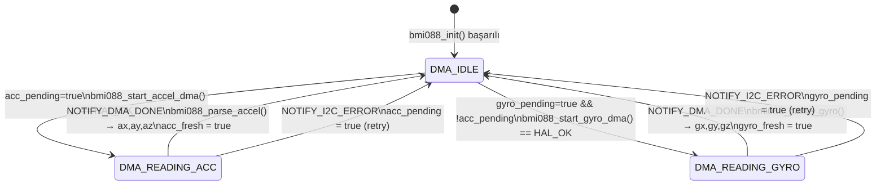
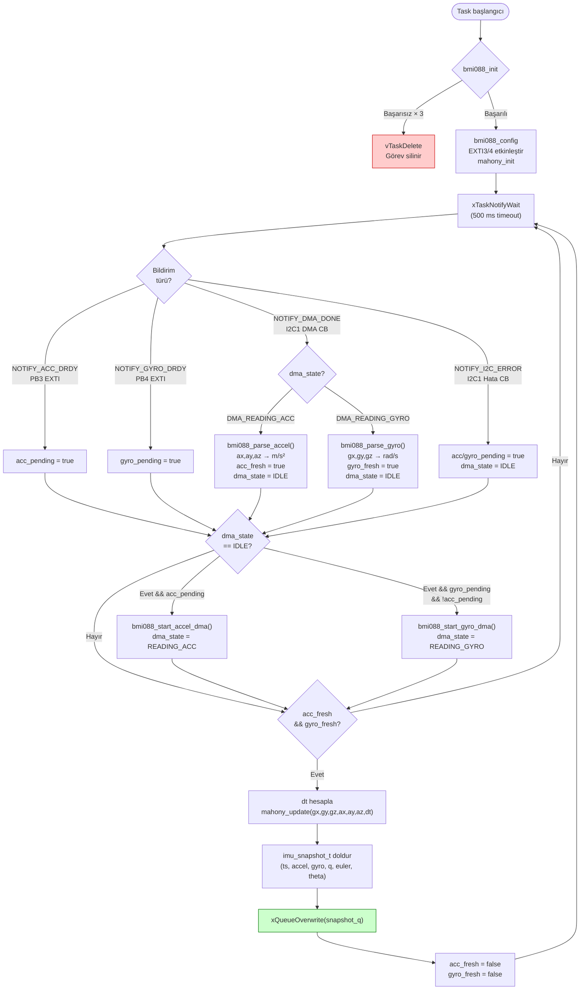

# Diyagram 4 — IMU Pipeline: DMA Durum Makinesi

Bölüm 3.3 ve 3.4.1 için. DRDY kesmesinden snapshot publish'e kadar tam IMU veri akışı.

> **Öncelik notu:** `acc_pending` her zaman `gyro_pending`'den önce işlenir — her iki sensörde DRDY aynı anda gelirse ivme önce okunur, ardından jiroskop. Bu sayede Mahony her iterasyonda güncel bir çift alır.
