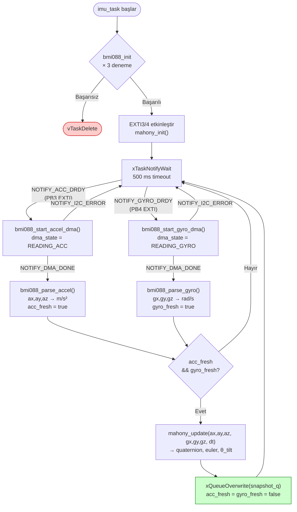

# Diyagram 4 — IMU Pipeline

Bölüm 3.3 ve 3.4.1 için. DRDY kesmesinden snapshot publish'e kadar tam IMU veri akışı.

> **Öncelik:** `acc_pending` her zaman `gyro_pending`'den önce işlenir; her iki DRDY aynı anda gelirse ivme önce okunur, böylece Mahony her iterasyonda güncel bir çift alır.
