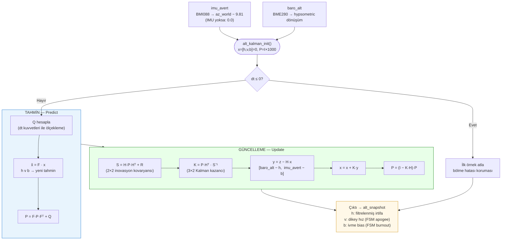

# Diyagram 9 — Yükseklik Kalman Filtresi: Tahmin ve Güncelleme Adımları

Bölüm 3.5.2 için. 3-durumlu Kalman filtresinin (h, v, b) tahmin ve güncelleme aşamaları.

> **R matrisi:** `r_alt = 5.0`, `r_acc = 10.0`. SUT modunda `r_acc = 5000` — IMU katkısı pratikte sıfıra indirilir, filtre saf barometrik Kalman gibi davranır.
