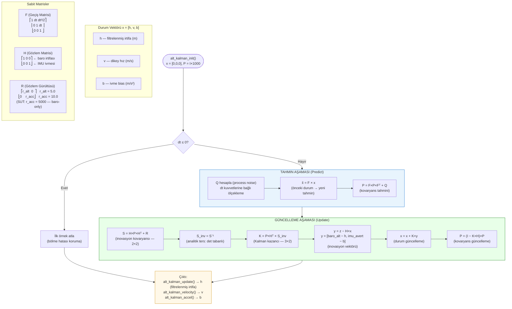
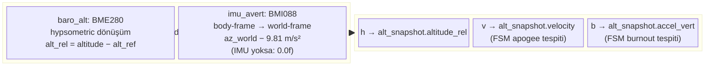

# Diyagram 9 — Yükseklik Kalman Filtresi: Tahmin ve Güncelleme Adımları

Bölüm 3.5.2 için. 3-durumlu Kalman filtresinin tahmin (predict) ve güncelleme (update) aşamaları.

> **SUT modunda ivme kanalı susturulmuştur:** `r_acc = 5000` ile IMU ivmesinin Kalman'a katkısı pratikte sıfıra indirilir; filtre saf barometrik Kalman gibi davranır. Bu, SUT ortamında yalnızca RocketPy baro verisinin doğrulanmasını sağlar.
