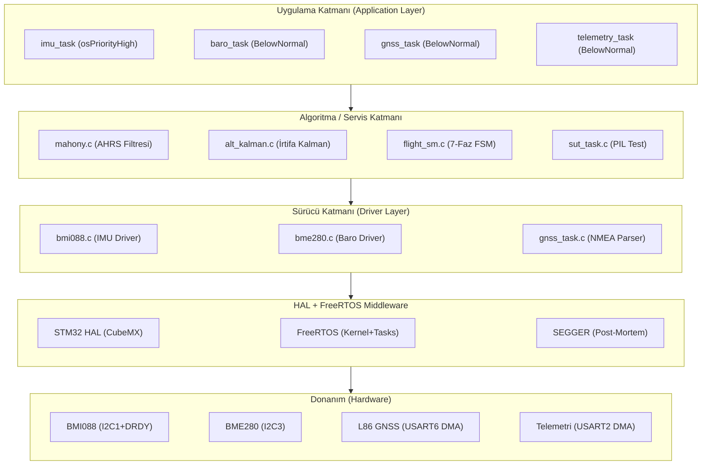

# Diyagram 2 — Katmanlı Yazılım Mimarisi

Bölüm 3.1 için. Tek yönlü bağımlılık ilkesiyle 4 katmanlı mimari.

> **Bağımlılık yönü:** Her katman yalnızca bir alt katmanı çağırır; yukarı doğru doğrudan çağrı yoktur. CubeMX üretilen `HAL` dosyalarına (`main.c`, `gpio.c`, `i2c.c` vb.) uygulama katmanından dokunulmaz.
