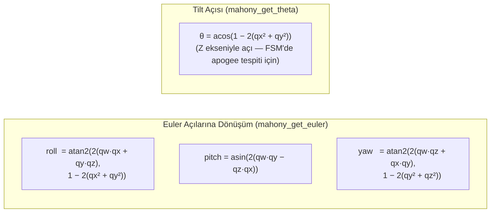

# Diyagram 8 — Mahony AHRS Filtresi Algoritma Akışı

Bölüm 3.5.1 için. 6DOF quaternion tabanlı姿态 kestirimi adım adım.

```mermaid
flowchart TD
    IN["Girdi:\ngx, gy, gz — jiroskop (rad/s)\nax, ay, az — ivmeölçer (m/s²)\ndt — zaman adımı (s)"]

    IN --> NORM_A{|a| > 0?}
    NORM_A -- Hayır --> GYRO_ONLY["Yalnızca jiroskop entegrasyonu\n(hata düzeltme atlanır)"]
    NORM_A -- Evet --> NORMALIZE["İvme normalize et\na_norm = a / |a|\n(inv_sqrt ile hızlı hesap)"]

    NORMALIZE --> GRAV_EST["Mevcut quaternion'dan\ntahmini yerçekimi yönü hesapla\nv = q ⊗ [0,0,1] ⊗ q⁻¹\n\nvx = 2(qx·qz − qw·qy)\nvy = 2(qy·qz + qw·qx)\nvz = 1 − 2(qx² + qy²)"]

    GRAV_EST --> ERROR["Hata hesapla (cross-product)\ne = a_norm × v\n\nex = ay·vz − az·vy\ney = az·vx − ax·vz\nez = ax·vy − ay·vx"]

    ERROR --> PI["PI düzeltme\nintegral += e × Ki × dt\n(Ki = 0.0 → integral devre dışı)\nω_korr = ω_gyro + Kp×e + integral\n(Kp = 0.5)"]

    GYRO_ONLY --> INTEGRATE
    PI --> INTEGRATE["Quaternion türev entegrasyonu\nq̇ = ½ × q ⊗ ω_korr\n\ndq.w = ½(−qx·ωx − qy·ωy − qz·ωz)\ndq.x = ½( qw·ωx + qy·ωz − qz·ωy)\ndq.y = ½( qw·ωy − qx·ωz + qz·ωx)\ndq.z = ½( qw·ωz + qx·ωy − qy·ωx)"]

    INTEGRATE --> UPDATE["q += dq × dt"]
    UPDATE --> NORM_Q["Quaternion normalize et\nq = q / |q|\n(inv_sqrt ile hızlı hesap)"]

    NORM_Q --> OUT["Çıktı:\nq = [qw, qx, qy, qz]\n(mahony_get_euler ile roll/pitch/yaw)\n(mahony_get_theta ile tilt açısı θ)"]

    style IN fill:#e8f4fd,stroke:#0066cc
    style OUT fill:#e8ffe8,stroke:#007700
    style ERROR fill:#fff8e8,stroke:#cc8800
    style PI fill:#fff8e8,stroke:#cc8800
```



> **inv_sqrt:** Quake III kaynaklı hızlı ters karekök. Cortex-M4 FPU olmasına rağmen kullanılmaya devam edilmiştir; ölçülen fark ihmal edilebilir ama orijinal implementasyondan gelen bir miras olarak korunmuştur.
