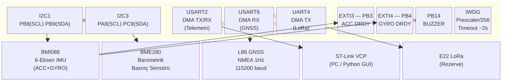

# Diyagram 1 — STM32F446 Donanım Blok Diyagramı

Bölüm 2.3 ve 3.2 için. MCU çevresel birimlerinin sensörlerle bağlantı haritası.

> **Not:** BMI088, ACC ve GYRO için ayrı I2C adresi kullanır; her ikisi de I2C1 bus üzerindedir. DRDY sinyalleri EXTI kesmesi üzerinden IMU task'ını uyandırır.
