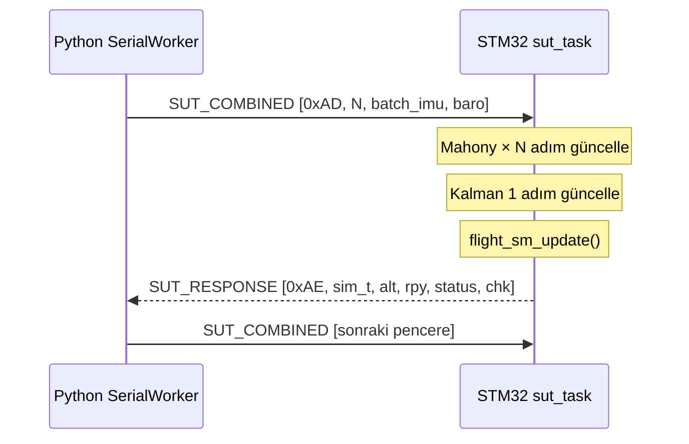

# Diyagram 7 — SUT (Sentetik Uçuş Testi) Sistem Mimarisi

Bölüm 3.8.2 için. Processor-in-the-Loop test sisteminin uçtan uca veri akışı.

> **Gerçek zamanlı pacing yoktur:** Python her pencereyi gönderir ve cevap bekler. STM32 gerçek C algoritmalarını çalıştırdığından algoritma doğruluğu garanti altındadır; ancak zamanlama STM32 işlem hızına bağlıdır.
