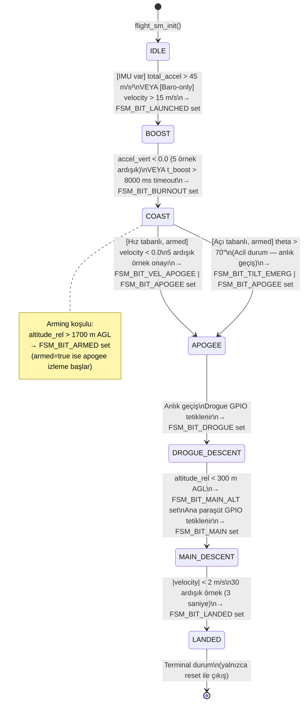
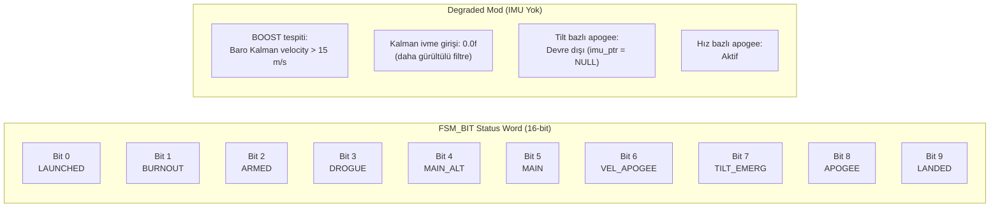

# Diyagram 6 — Uçuş Durum Makinesi (7-Faz FSM)

Bölüm 3.6 için. Her geçişin koşulu ve eşik değerleri ile birlikte tam FSM. Degraded (baro-only) mod kırmızı okla gösterilmiştir.

> **Hız ve açı tabanlı apogee bağımsız çalışır:** Her ikisi de `s_armed == true` olduktan sonra, fazdan bağımsız olarak her `flight_sm_update()` çağrısında kontrol edilir. Yalnızca `FLIGHT_COAST` fazındayken `FLIGHT_APOGEE`'ye geçişi tetikler; diğer fazlarda yalnızca status bit set edilir.
