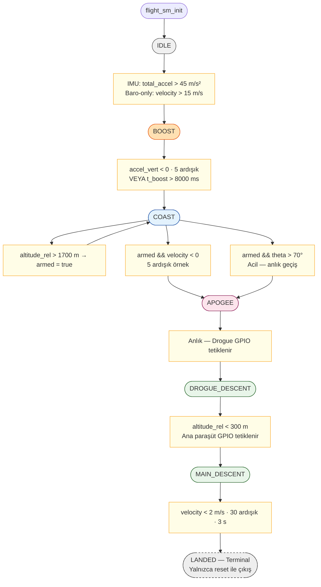

# Diyagram 6 — Uçuş Durum Makinesi (7-Faz FSM)

Bölüm 3.6 için. Her geçişin koşulu ve eşik değerleri ile birlikte tam FSM.

> **Hız ve açı tabanlı apogee bağımsız çalışır:** Her ikisi de `armed == true` olduktan sonra her `flight_sm_update()` çağrısında kontrol edilir; yalnızca `COAST` fazındayken `APOGEE` geçişini tetikler.
